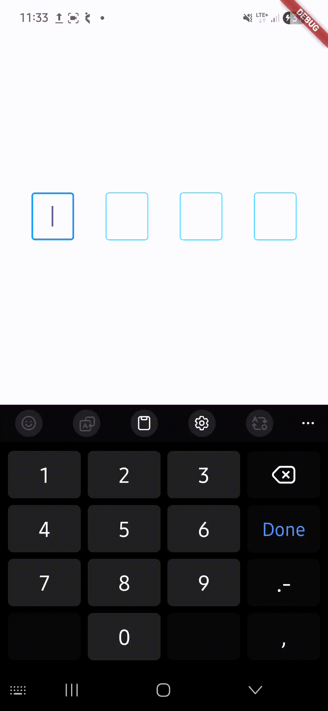

# AutofillOtp

A customizable Flutter OTP input widget with:

* Auto focus movement
* Backspace navigation
* OTP paste support
* Prevent skipping empty fields
* Autofill OTP support
* Obscure text support
* Custom border styling
* Completion & change callbacks

---

# ✨ Features

✅ Auto move to next field
✅ Move back on backspace
✅ Paste full OTP support
✅ Autofill OTP support
✅ Prevent skipping fields
✅ Custom border colors
✅ Obscure OTP support
✅ Show / hide cursor
✅ OTP completed callback
✅ OTP change callback

---

# 📦 Installation

Add dependency inside `pubspec.yaml`

```yaml
dependencies:
  autofill_otp: latest_version
```

Then run:

```bash
flutter pub get
```

---

# 🚀 Import

```dart
import 'package:autofill_otp/autofill_otp.dart';
```

---

# 🧩 Basic Usage

```dart
AutofillOtp(
  numberOfTextFields: 6,
)
```

---

# 🎨 Customized Example

```dart
AutofillOtp(
  numberOfTextFields: 6,
  autoFocus: true,
  obscureText: false,
  showCursor: true,
  enabledBorderColor: Colors.grey,
  focusBorderColor: Colors.blue,
  focusBorderwidth: 2,

  onChanged: (otp) {
    print("Current OTP: $otp");
  },

  onCompleted: (otp) {
    print("Completed OTP: $otp");
  },
)
```

---

# ⚙️ Parameters

| Parameter            | Type                    | Default       | Description                        |
| -------------------- | ----------------------- | ------------- | ---------------------------------- |
| `numberOfTextFields` | `int`                   | Required      | Number of OTP input fields         |
| `enabledBorderColor` | `Color?`                | `Colors.grey` | Border color when field is enabled |
| `focusBorderColor`   | `Color?`                | `Colors.grey` | Border color when field is focused |
| `focusBorderwidth`   | `double?`               | `2`           | Focus border width                 |
| `autoFocus`          | `bool`                  | `true`        | Automatically focus first field    |
| `obscureText`        | `bool`                  | `false`       | Hide OTP digits                    |
| `showCursor`         | `bool`                  | `true`        | Show or hide cursor                |
| `onChanged`          | `Function(String otp)?` | `null`        | Called whenever OTP changes        |
| `onCompleted`        | `Function(String otp)?` | `null`        | Called when all fields are filled  |

---

# 📱 OTP Paste Support

Users can paste complete OTP directly.

Example:

```text
123456
```

The widget automatically:

* Splits OTP into all fields
* Moves focus correctly
* Calls completion callback

---

# 🔐 Obscure OTP Example

```dart
AutofillOtp(
  numberOfTextFields: 4,
  obscureText: true,
)
```

---

# 🎯 Callbacks

## onChanged

```dart
onChanged: (otp) {
  print(otp);
}
```

Called whenever OTP value changes.

---

## onCompleted

```dart
onCompleted: (otp) {
  print("OTP Completed: $otp");
}
```

Called when all OTP fields are filled.

---

# 🧠 Smart Behaviors

* Prevents skipping fields
* Handles backspace navigation
* Supports OTP autofill
* Supports OTP paste
* Automatically moves focus
* Automatically dismisses keyboard after completion

---

# 📸 Preview

## 📸 Manual OTP Fill



## ⚡ Autofill OTP


# 🤝 Contributing

Pull requests are welcome.

If you find bugs or want new features, feel free to open an issue.

---

# 📄 License

MIT License
Copyright (c) 2026 Excelsior Technologies

Permission is hereby granted, free of charge, to any person obtaining a copy
of this software and associated documentation files (the "Software"), to deal
in the Software without restriction, including without limitation the rights
to use, copy, modify, merge, publish, distribute, sublicense, and/or sell
copies of the Software, and to permit persons to whom the Software is
furnished to do so, subject to the following conditions:

The above copyright notice and this permission notice shall be included in all
copies or substantial portions of the Software.

THE SOFTWARE IS PROVIDED "AS IS", WITHOUT WARRANTY OF ANY KIND, EXPRESS OR
IMPLIED, INCLUDING BUT NOT LIMITED TO THE WARRANTIES OF MERCHANTABILITY,
FITNESS FOR A PARTICULAR PURPOSE AND NONINFRINGEMENT. IN NO EVENT SHALL THE
AUTHORS OR COPYRIGHT HOLDERS BE LIABLE FOR ANY CLAIM, DAMAGES OR OTHER
LIABILITY, WHETHER IN AN ACTION OF CONTRACT, TORT OR OTHERWISE, ARISING FROM,
OUT OF OR IN CONNECTION WITH THE SOFTWARE OR THE USE OR OTHER DEALINGS IN THE
SOFTWARE.
